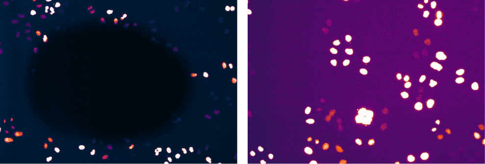

# 1. Preprocess Movies

In this module, we present our pipline for preprocessing mitosis movies.

### A. Quality Control

MitoCheck consortium pre-preprocessed the mitosis movies in a two-step quality control procedure based on automatic and manual inspection of data (see [quality control](https://static-content.springer.com/esm/art%3A10.1038%2Fnature08869/MediaObjects/41586_2010_BFnature08869_MOESM58_ESM.pdf) section of original paper's methods for more details).
MitoCheck applied this procedure to the movies before uploading any data to IDR.
Therefore, we did not use any movies that failed original quality-control (MitoCheck didn't upload these data).

We discard well A1 from each plate, as each of these wells had irregular illumination. 


**Figure 1**: *Illumination function of an A1 well (left) vs a typical illumination function (right).*

While a typical microscopy illumination involves vignetting in the image (as demonstrated in every well besides A1), this was not the case for any A1 well that was manually inspected (figure 1).
This irregular illumination led to errors in illumination correction later in preprocessing.

### B. Illumination Correction 

We use the BaSiC method for illumination correction of each well.
BaSiC was first introduced in [Peng, T., Thorn, K., Schroeder, T. et al., 2017](https://doi.org/10.1038/ncomms14836) and we use the [BaSiCPy implementation](https://github.com/peng-lab/BaSiCPy).

In the future we hope to implement a newer method of illumination correction introduced in [Peng, T et al., 2020](https://doi.org/10.1007/978-3-030-59722-1_17) once this method is [made available in python](https://github.com/peng-lab/BaSiCPy/issues/65).

## Step 1: Install PyImageJ

We use [PyImageJ](https://github.com/imagej/pyimagej) to read data from the raw CH5 movies downloaded from IDR.
Follow the instructions at [pyimagej/install](https://github.com/imagej/pyimagej/blob/master/doc/Install.md) to install PyImageJ.
We use the pip installation method.

## Step 2: Install Fiji

PyImageJ needs to use be initialized with [FIJI](https://imagej.net/software/fiji/) to be able to read CH5 files.
Download FIJI from the [downloads page](https://imagej.net/software/fiji/downloads) and install the Fiji.app folder into the 1.preprocesss_data module.

## Step 3: Install PyBaSiC

Clone the repository into 1.preprocess_data/ with 

```console
git clone https://github.com/peng-lab/PyBaSiC.git
```

As of the creation of this module, `pip install` does not work with this package and thus is not used.

## Step 4: Setup Preprocessing Environment

### Step 4a: Create Preprocessing Environment

```sh
# Run this command to create the conda environment for Preprocessing data
conda env create -f 1.preprocess_env.yml
```

### Step 4b: Activate Preprocessing Environment

```sh
# Run this command to activate the conda environment for Preprocessing data
conda activate 1.preprocess_data_mitocheck
```

## Step 5: Execute Training Data Preprocessing

```bash
# Run this script to preprocess training movies
bash 1.preprocess_training_movies.sh
```