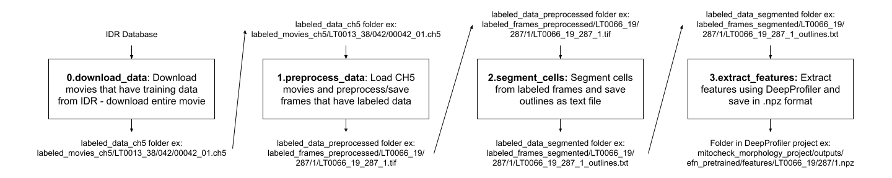

# MitoCheck Data

## Data

### Access

All data are publicly available.

#### Confocal Microscopy

| Data | Level | Location | Notes |
| :---- | :---- | :------ | :---- |
| Images | 1 | Image Data Resource ([IDR](https://idr.openmicroscopy.org/)) | Accession `idr0013(screenA)` |

## Pipeline:

The movie processing pipeline consists of the following steps:

| Order | Module | Description |
| :---- | :----- | :---------- |
| [0.download_data](0.download_data/) | Download mitosis movies | Retrieve mitosis movies hosted by IDR |
| [1.preprocess_data](1.preprocess_data/) | Preprocess mitosis movies | Perform quality control and illumination correction on mitosis movies |
| [2.segment_nuclei](2.segment_nuclei/) | Segment nuclei | Retrieve center X,Y for nuclei in mitosis movies |
| [3.extract_features](3.extract_features/) | Extract features | Extract nuclei features from mitosis movies with Deep Profiler |
| [4.preprocess_features](4.preprocess_features/) | Preprocess features | Preprocess features extracted during [3.extract_features](3.extract_features/) |

The workflow for processing data is shown below:

